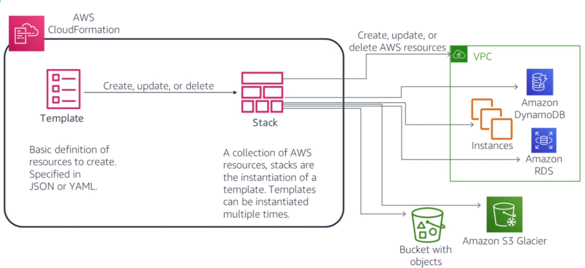
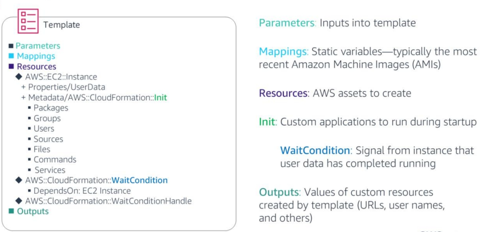

<!--

-->

# Infrastructure as Code: AWS CloudFormation
### Week 8.5

---

# What you will Learn 

<v-clicks>

* Understand the importance of infrastructure as code 
* Describe the purpose of AWS CloudFormation. 
* Create an AWS CloudFormation template.
* Use AWS CloudFormation best practices.

</v-clicks>

---

# Cloud Deployment Challenges

<v-clicks> 

* The cloud opens up many possibilities. However, it also raises questions about how to manage its power and flexibility, such as:
* How do you update servers that have already been deployed into a production environment?
* How do you consistently deploy infrastructure to multiple regions? 
* How do you roll back a deployment that did not run according to plan? 
* How do you test and debug a deployment before you roll it out to production?

</v-clicks>

---

# AWS CloudFormation

<v-clicks> 

* AWS CloudFormation enables you to create and provision AWS infrastructure deployments predictably and repeatedly. 
* AWS CloudFormation enables you to use a template file to create and delete a collection of resources, which are managed together as a single unit (a stack).
* Though you manage your resources through AWS CloudFormation, users can change those resources outside of AWS CloudFormation.
* Users can edit resources directly by using the underlying service that created the resource. 
* For example, you can use the Amazon EC2 console to update a server instance that was created as part of an AWS CloudFormation stack. 
* Some changes might be accidental, and some might be made intentionally to respond to time-sensitive operational events.

</v-clicks>

---

# AWS CloudFormation

<v-clicks> 

* Regardless, changes that are made outside of AWS CloudFormation can complicate stack update or deletion operations.
* You can use drift detection to identify which stack resources have configuration changes that were made outside of AWS CloudFormation management. 
* You can then take corrective action so that your stack resources are synchronized again with their definitions in the stack template. 
* For example, you could update the drifted resources directly so that they agree with their template definition. 
* Resolving drift helps to ensure the consistency of your configuration and the success of your stack operations.
  
  
</v-clicks>

---

# AWS CloudFormation Terminology 

<figure>
    
</figure>

---

# AWS CloudFormation Terminology 

<v-clicks> 

* Two major terms for AWS CloudFormation are **templates** and **stacks**. 
* A template is a specification of the AWS resources to be provisioned.
* A stack is a collection of AWS resources that were created from a template. You might provision (create) a stack many times.
* When a stack is provisioned, the AWS resources that are specified by the stack template are created. 
* Any charges incurred from using these services will start accruing when they are created as part of the AWS CloudFormation stack.
* When a stack is deleted, the resources that are associated with that stack are deleted. 
* The order of deletion is determined by AWS CloudFormation. You do not have direct control over what gets deleted and when.

</v-clicks>

---

# Template Structure

<figure>
    
</figure>

---

# Template Structure

<v-clicks>

* Parameters is an optional section of the template. When parameters are present, they include name-value pairs. These parameters can then be referenced later in the template.
* Mappings are also an optional section of the template. Mappings are typically used to refer to the values of the most current AMIs in a region because they differ by region. 
* Resources is a required section of the template. The Resources section contains the AWS objects that you will create. You can create resources across a large number of AWS services, including Amazon EC2, Amazon S3, Amazon VPC, and many others. You can specify relationships and dependencies between resources to ensure that resources are created in the correct order.

</v-clicks>

---

# Template Structure

<v-clicks>

* Init. The CloudFormation::Init resource type enables you to deploy applications, files, and other resources onto your EC2 instances as part of the deployment process.
* WaitCondition. The CloudFormation::WaitCondition resource type is used to coordinate resource creation. For example, suppose that a resource has a dependency on another resource. AWS CloudFormation will wait for other resource creation activities to complete before it attempts to create the dependent resource. WaitConditions enable you to signal back to AWS when your CloudFormation::Init commands finish running successfully.
* Outputs is an optional section of the template. The Outputs section returns string values that are created by the template and that might be important to users. For example, if you create an EC2 instance that functions as a public web server, you might choose to output the full public Domain Name Server (DNS) name of the server in the Outputs section.

</v-clicks>

---

# CloudFormation Best Practices

<v-clicks>

* Use the lifecycle and ownership of your AWS resources to help you decide what resources should go in each stack. 
  * As your stack grows in scale and broadens in scope, managing a single stack can be cumbersome and time-consuming. 
  * By grouping resources with common lifecycles and ownership, owners can make changes to their set of resources by using their process and schedule without affecting other resources.
* Reuse templates to replicate stacks in multiple environments. 
  * After you have your stacks and resources set up, you can reuse your templates to replicate your infrastructure in multiple environments. 
  * For example, you can create environments for development, testing, and production so that you can test changes before you implement them into production.

</v-clicks>

---

# CloudFormation Best Practices

<v-clicks>

* Verify quotas for all resource types. 
  * Before you launch a stack, ensure that you can create all the resources that you want without exceeding your AWS account limits.
  * You can use AWS Trusted Advisor checks to ensure that the limits for certain EC2 instances are not going to be passed, and if so, request a service limit increase from the tool.
* Avoid embedding credentials in your templates. 
  * Instead, use input parameters to pass information when you create or update a stack.
* Use parameter types that are specific to AWS. 
  * AWS CloudFormation can quickly validate values for these parameter types before it creates your stack.

</v-clicks>

---

# CloudFormation Best Practices 

<v-clicks> 

* Use parameter constraints. 
  * With constraints, you can describe allowed input values so that AWS CloudFormation catches any invalid values before it creates a stack.
* Use AWS::CloudFormation::Init to deploy software applications on EC2 instances. 
  * By using AWS::CloudFormation::Init, you can describe the configurations that you want, instead of scripting procedural steps.
* Validate templates before you use them. 
  * Validating a template can help you catch syntax errors and some semantic errors before AWS CloudFormation creates any resources.

</v-clicks>

---

# CloudFormation Best Practices 

<v-clicks> 

* Manage all stack resources through AWS CloudFormation. 
  * After you launch a stack, use the AWS CloudFormation console, API, or the AWS CLI to update resources in your stack. 
  * Do not make changes to stack resources outside of AWS CloudFormation. 
  * Doing so can create a mismatch between your stack's template and the current state of your stack resources, which can cause errors if you update or delete the stack.
* Create change sets before you update stacks. 
  * Change sets enable you to see how proposed changes to a stack might impact your running resources before you implement them
  * AWS CloudFormation does not make any changes to your stack until you run the change set, which enables you to decide whether to proceed with your proposed changes or create another change set.

</v-clicks>

---

# CloudFormation Best Practices

<v-clicks> 

* Use stack policies. 
  * Stack policies help protect critical stack resources from unintentional updates that could cause resources to be interrupted or even replaced. 
  * Specify a stack policy when you create a stack that has critical resources.
* Use AWS CloudTrail to log AWS CloudFormation calls. 
  * AWS CloudTrail tracks anyone who makes AWS CloudFormation API calls in your AWS account. 
  * API calls are logged when anyone uses the AWS CloudFormation API, the AWS CloudFormation console, a backend console, or AWS CLI commands for AWS CloudFormation. 
  * Enable logging and specify an S3 bucket to store the logs. 
  * By doing so, you can audit who made which AWS CloudFormation call in your account when needed.

</v-clicks>

---

# CloudFormation Best Practices

<v-clicks> 

* Use code reviews and revision controls to manage templates.
  * Stack templates describe the configuration of your AWS resources, such as their property values. 
  * These methods help track changes between different versions of templates, which helps track changes to stack resources. Also, by maintaining a history, you can revert your stack to a certain version of your template

</v-clicks>

---

# Key Takeaways

<v-clicks>

*  AWS CloudFormation enables you to create and provision AWS infrastructure deployments predictably and repeatedly.
* Two major terms for AWS CloudFormation are *templates* and *stacks*.
* If an error is encountered when you launch an AWS CloudFormation template, all resources are rolled back by default.
* Parameters enable you to input custom values to your template each time you create or update a stack.
  
</v-clicks>
