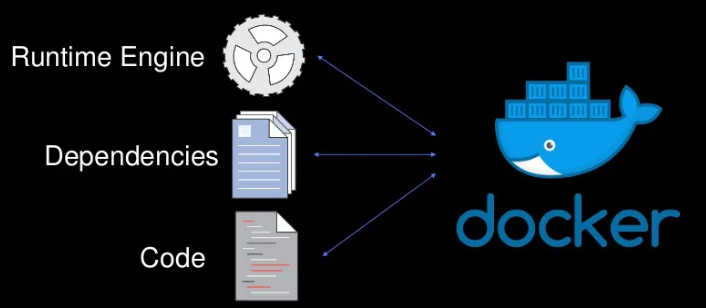
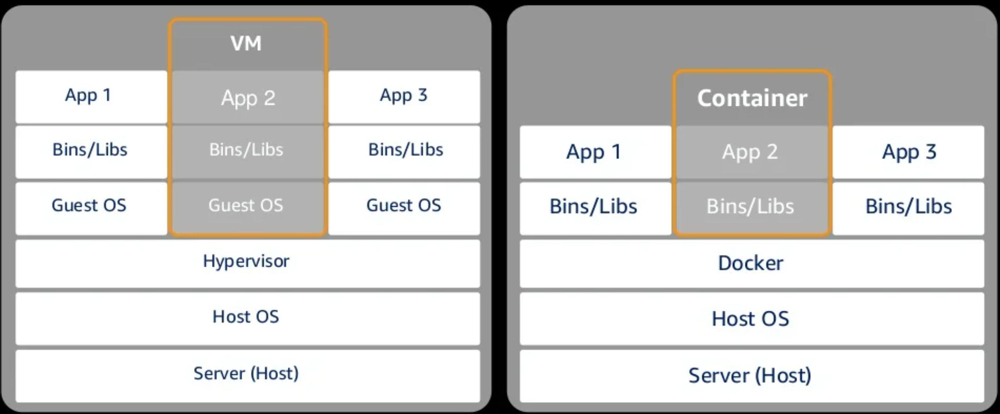

<!--

-->

# Containers on AWS
### Week 8.4

---

# What you will Learn 

<v-clicks>

* Explain the purpose and function of containers and the AWS services that support container usage.
* Characterize containers and the benefits of containers. 

</v-clicks>

---

# The Problem

<v-clicks> 

* "It ran on my machine, why not in production?!"
* "You need to update your computer’s operating system!" 
* "You don’t have all the software you need to run that!” 

</v-clicks>

---

# Containers

<v-clicks> 

* Similar to how virtual machines virtualize hardware, containers virtualize an operating system. 
* Amazon EC2 runs virtual machines, where an entire operating system—such as Linux or Microsoft Windows—has been virtualized.
* Containers are smaller and do not contain an entire operating system. 
* Instead, containers share a virtualized operating system and run as resource-isolated processes, which ensure quick, reliable, and consistent deployments. 
* Containers hold everything that the software needs to run, such as libraries, system tools, code, and runtime.

</v-clicks>

---

# Benefits of using Containers

<v-clicks> 

* Containers deliver environmental consistency because the application’s code, configurations, and dependencies are packaged into a single object. 
  * They serve as a building block that can be deployed on any compute resource regardless of software, operating system, or hardware configurations. 
* Containers also provide process isolation. 
  * They have no shared dependencies or incompatibilities because each container is isolated from the other.
  * Whatever you package as a container locally will deploy and run the same way, whether in testing or production.
  * Process isolation provides operational efficiency. 
  
  
</v-clicks>

---

# Benefits of using Containers

<v-clicks> 

* Containers also enable to you run multiple applications on the same instance. • 
  * You can specify the exact amount of memory, disk space, and central processing unit (CPU) that a container will use on an instance.
  * Containers boot quickly, and the reduced footprint enables you to create and terminate applications or tasks that are encapsulated in a container.
  * These features enable you to scale applications up and down rapidly. 
* Containers increase developer productivity by removing cross-service dependencies and conflicts. 
  * Each application component can be broken into different containers that run a different microservice.
  * Containers are isolated from each other, so you do not have to worry about synchronizing libraries or dependencies for each service.
  * Developers can independently upgrade each service because the libraries have no conflicts.
  
</v-clicks> 

---

# Benefits of using Containers

<v-clicks> 

* Containers enable you to track versions of your application code and their dependencies. Docker container images have a manifest file (Dockerfile) that enables you to: 
  * Easily maintain and track versions of a container 
  * Inspect differences between versions
  * Roll back to previous versions
* Containers help us solve some of the problems with new and updated software, but how do we create and run a container? manage and deploy multiple containers?

</v-clicks>

---

# Docker

<figure>
    
</figure>

<v-clicks>

* Docker is a software platform that packages software (such as applications) into containers that holds everything that the software needs to run. 

</v-clicks>

---

# Docker

<v-clicks>

* Docker is installed on each server that will host containers, and it provides simple commands that you can use to build, start, or stop containers.
* Docker containers include only the things an application needs to run, so this enables applications to be moved between environments quickly and easily.
* Docker is best used as a solution when you want to: 
  * Standardize environments 
  * Reduce conflicts between language stacks and versions 
  * Use containers as a service 
  * Run microservices by using standardized code deployments  
  * Require portability for data processing

</v-clicks>

---

# Virtual Machine vs Docker

<figure>
    
</figure>

---

# Amazon Elastic Container Registry 

<v-clicks>

* Amazon Elastic Container Registry (Amazon ECR) is a fully-managed Docker container registry. 
* With Amazon ECR, it is easy for developers to store, manage, and deploy Docker container images. 
* A docker container image is a blueprint for creating containers. Images are immutable and all containers created from the same image are exactly alike. 
* It is integrated with Amazon Elastic Container Service (Amazon ECS) so that you can store, run, and manage container images for applications that run on Amazon ECS. 
* Specify the Amazon ECR repository in your task definition, and Amazon ECS will retrieve the appropriate images for your applications.
* Amazon ECR stores your container images in Amazon Simple Storage Service (Amazon S3) so it benefits from the high availability and durability of Amazon S3.

</v-clicks>

---

# Amazon Elastic Container Registry 

<v-clicks>

* You can organize your repositories based on your team’s existing workflows by using namespaces. 
* Amazon ECR uses AWS IAM for access control. It enables you to control who and what (for example, EC2 instances) can access your container images through defined policies.
* You can transfer your container images to and from Amazon ECS via HTTPS. 
* Your images are also automatically encrypted at rest by using Amazon S3 server-side encryption.

</v-clicks>

---

# Amazon Elastic Container Service

<v-clicks>

* Amazon Elastic Container Service (Amazon ECS) is a highly scalable, high-performance container management service that supports Docker containers. 
* It enables you to run applications on a managed cluster of EC2 instances.
* It provides flexible scheduling - Amazon ECS uses a built-in scheduler or it uses a third-party scheduler. 
* The Amazon ECS application programming interfaces (APIs) make it straightforward to integrate third-party solutions—such as schedulers—or support your software delivery process. 
* Amazon ECS launches your containers in your VPC, which enables you to use your VPC security groups and network ACLs. 
* No compute resources are shared with other customers. 
* With AWS IAM, you can assign granular access permissions for each of your containers, restrict access to each service and configure which resources a container can access.

</v-clicks>

---

# Amazon Elastic Container Service 

<v-clicks> 

* These configurable isolation features of Amazon ECS are designed to help you build secure and reliable applications.
* You can use Amazon ECS to launch tens (or tens of thousands) of Docker containers in seconds, with no additional complexity.
* Amazon ECS tasks are defined through a declarative JSON template that is called a task definition. 
* With this template, you can specify one or more containers that are required for your task, including 
  * The Docker repository and image 
  * Memory and CPU requirements 
  * Shared data volumes 
* You can launch as many tasks as you want from a single task definition, which you register with the service.

</v-clicks>

---

# Kubernetes

<v-clicks> 

* Kubernetes is open-source software for container management and orchestration software that is open source. 
* It enables you to deploy and manage containerized applications at scale. 
* With Kubernetes, you can run any type of containerized application by using the same toolset on-premises and in the cloud.
* Kubernetes works by managing a cluster of compute instances. 
* It runs scheduling containers on the cluster, based on where compute resources are available. 
* This scheduling also considers the resource requirements of each container that you will run to support your applications.

</v-clicks>

---

# Kubernetes

<v-clicks> 

* Containers are run in logical groupings that are called pods, and you can run and scale one or many containers together as a pod.
* Kubernetes enables you to define complex, containerized applications and run them at scale across a cluster of servers.
* Applications can be seamlessly moved from local development machines to production deployments on the cloud by using the same operational tooling.

</v-clicks>

---

# Amazon Elastic Kubernetes Service 

<v-clicks> 

* You can manage the Kubernetes infrastructure yourself by running it on EC2 instances. 
* Or, you can use an automatically provisioned, managed Kubernetes control plane with Amazon Elastic Kubernetes Service (Amazon EKS).
* Amazon EKS makes it easy to deploy, manage, and scale containerized applications by using Kubernetes. 
* It runs the Kubernetes management infrastructure for you across multiple AWS Availability Zones to avoid having a single point of failure. 
* Amazon EKS is a certified Kubernetes conformant, so you can use existing tools and plugins from AWS Partners and the Kubernetes community. 
* Applications that run on any standard Kubernetes environment are fully compatible and can be migrated to Amazon EKS.

</v-clicks>

---

# AWS Fargate: Run containers without managing servers 

<v-clicks>

* AWS Fargate is a technology for Amazon ECS that enables you to run containers without needing to manage servers or clusters.
* Amazon ECS can use containers that are provisioned by Fargate to automatically scale, load balance, and manage the scheduling of your containers for availability. 
* This method provides an easier way to build and operate containerized applications. 
* It removes the need to choose server types, decide when to scale your clusters or optimize cluster packing.
* All Amazon ECS clusters are heterogeneous—you can run both Fargate and Amazon ECS tasks in the same cluster. 
* You pay by the task size and only for the time for which the task consumes resources. 
* The price for CPU and memory is charged on a per-second basis and the minimum charge is for one minute.

</v-clicks>

---

# Key Takeaways

<v-clicks>

* Containers hold everything that the software needs to run, such as libraries, system tools, code, and runtime.
* Docker is a software platform that packages software (such as applications) into units that are called containers.
* Kubernetes is open-source software for container orchestration. It enables you to deploy and manage containerized applications at scale.
  
</v-clicks>
