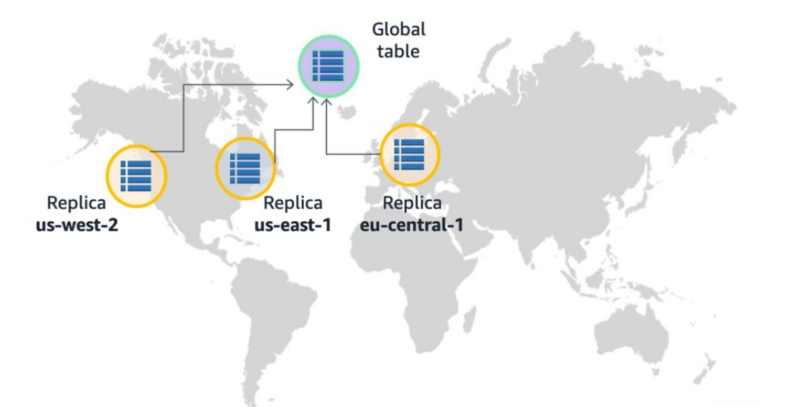
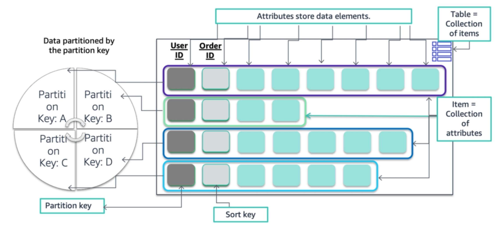

<!--

-->

#  Amazon DynamoDB

Week 7.1

---

# What you will Learn 


<v-clicks>

*  Understand use cases for relational and non-relational databases.
*  Describe the details of the Amazon DynamoDB database service.
*  Understand DynamoDB core concepts - tables, items, and attributes.
*  Understand data is stored and retrieved in DynamoDB.

</v-clicks>


---

# Relational Databases

<v-clicks> 

* The high cost of storage was a significant problem in the early days of data storage
* Large amounts of storage were needed for unstructured data, and as the need for quick access to the data increased, so did the need to better control the cost of managing that data while simultaneously continuing to meet performance requirements.
* The relational database management system provided a way to normalize the data, to provide a methodology for analytical processing.
* It provided better access and organization for the data being created and provided a system that could be both redundant and scalable.
* The relational approach also offered a trade-off between CPU and storage expenses.
*  While the data was being stored in a much more efficient manner, the ability to consume and normalize that data required more compute capabilities than was originally needed.

</v-clicks>


---

# Why NoSQL?

<v-clicks> 

* Although relational database systems represented a significant advancement in data administration and helped to reduce the cost associated with data storage.
* The trade-offs were that data management became more expensive from a computational perspective.
* Additionally, relational systems are great for analytical processing, but what about scenarios where you need something more focused on transactional tasks?
* Those are some of the areas where NoSQL options can aid in application. 
* There are some areas where NoSQL systems do not always find their advantages. 
* NoSQL systems do not have cross-table relationships. 
* Where traditional databases supported data access across tables with a single query, NoSQL options require additional tools or functions to make calls to multiple tables at once.

</v-clicks>


---

# NoSQL Databases 

<v-clicks> 

* There are three main types of NoSQL databases - **key-value**, **column-based**, and **document-based** storage. 
* The document-based store is categorized by its ability to store documents made up of tagged elements.
* With column-based or column-oriented databases, data is stored and optimized for fast retrieval of a lot of data. 
* This is in contrast to the row-based storage or row-oriented storage of traditional relational databases. 
* With columnar systems, you can work and retrieve large datasets because of column-based retrieval. 
* Key-value data stores provide large hash tables of keys and values that give you the ability to query for items that are organized by their key structure.
  
</v-clicks>


---

# Introduction to Amazon DynamoDB

<v-clicks> 

* Amazon DynamoDB is a fully managed NoSQL database service. 
* Amazon manages all of the underlying data infrastructures for this service with less focus on building and architecting the underlying system, and more able to focus on performance. 
* DynamoDB gives you the ability to directly manage the level of performance you want to achieve through adjustment of your read and write capacity units. 
* It redundantly stores data across multiple facilities in a region as part of its fault-tolerant architecture. 
* With DynamoDB, you can create tables and items. 
* It automatically partitions your data and provides table storage to meet workload requirements.
  
</v-clicks>


---

# Amazon DynamoDB Technical Benefits

<v-clicks> 

* Amazon DynamoDB is a fast and flexible NoSQL database service that supports both the document and key-value store models. 
* Its benefits include: 
* Fully managed service 
  - When you create a database table and set your target utilization for automatic scaling, the service automatically performs database management tasks. 
  - It handles hardware or software provisioning, setup and configuration, software patching, operating a distributed database cluster, and partitioning data over multiple instances as you scale. 
  - DynamoDB also provides point-in-time recovery, backup, and restoration for all your tables.

</v-clicks>


---

# Amazon DynamoDB Technical Benefits

<v-clicks>

* Low-latency queries 
  - The average service-side latency for running a query is typically single-digit milliseconds. 
  - As your data volumes grow and application performance demands increase, DynamoDB adapts to meet these needs. 
  - It uses automatic partitioning and SSD technologies to achieve your throughput requirements and to deliver low latencies at any scale.
* Fine-grained access control 
  - You can use DynamoDB with AWS IAM for fine-grained access control of users in your organization. 
  - You can assign unique security credentials to each user and control each user's access to services and resources.

</v-clicks>


---

# Amazon DynamoDB Technical Benefits

<v-clicks>

* Flexibility
  - DynamoDB supports storing, querying, and updating data as JavaScript Object Notation (JSON) documents. 
  - This support makes it ideal for storing semistructured data and manipulating it by using JSON queries.
  - DynamoDB gives you the flexibility to add attributes as your application evolves. 
* Scaling 
  - DynamoDB automatically manages your database infrastructure, including provisioning and scaling of your tables. 
  - As the number of application users grows, DynamoDB tables can be scaled to handle the increased numbers of read-write requests with manual provisioning. 
  - Alternatively, you can enable automatic scaling so that DynamoDB monitors the load on the table and automatically increases or decreases the provisioned throughput.

</v-clicks>

<!-- * Additionally, you can also use Amazon DynamoDB with Amazon CloudWatch so that you can see throughput and latency request statistics. -->

---

# Core Concepts: Tables, Items and Attributes 

<v-clicks>

* Tables:
  - Similar to other database systems, DynamoDB stores data in tables. 
  - A table is a collection of zero or more items that are organized and can be queried through their keys.
  - For example, think about a table called `Students` that you can use to store the contact information of students.
* Items:
  - An item is a group of attributes that is uniquely identifiable among all other items.
  - With the example `Students` table, each item can represent a student.

</v-clicks>


---

# Core Concepts: Tables, Items and Attributes 

<v-clicks>

* Attributes:
  - An attribute is a fundamental data element, something that does not need to be broken down any further.
  - An item in the `Students` table can contain attributes called `_id`, `FirstName`, `LastName`, `EmailAddress` and so on. 

</v-clicks>

```json 
{
  "_id": "627aa804991edad9f46977b8",
  "FirstName": "John",
  "LastName": "Doe",
  "EmailAddress": "john@hiit.ng"
}
```


---

# Amazon DynamoDB Global Tables

<figure>
    
</figure>

---

# Amazon DynamoDB Global Tables

<v-clicks> 

* The DynamoDB global tables feature provides high availability and scalability across Regions.
* A global table is a collection of one or more DynamoDB tables, which must all be owned by a single AWS account. 
* The tables in the collection are also known as replica tables.
* A replica table (or replica) is a single DynamoDB table that functions as a part of a global table. 
* Each replica stores the same set of data items. 
* Any given global table can only have one replica table per Region. 
* Every replica has the same table name and the same primary key definition.

</v-clicks>


---

# Amazon DynamoDB Global Tables 

<v-clicks> 

* When you create a global table, you specify the AWS Regions where you want the table to be available. 
* DynamoDB performs all of the necessary tasks to create identical tables in these Regions, and it propagates ongoing data changes to all of them.
* DynamoDB global tables work well for large-scale applications with globally dispersed users. 
* In such an environment, users expect fast application performance, which they obtain by accessing the replica that is closest to them. 
* In addition, if one of the AWS regions becomes temporarily unavailable, users can still access the same data in the other regions.

</v-clicks>


---

# Core Concepts: Partition Keys and Sort Keys 

<v-clicks> 

* When you create a DynamoDB table, you must specify the table name and the primary key of the table.
* Primary keys uniquely identify each item in the table, so that no two items can have the same key.  
* DynamoDB supports two different types of primary keys:
  - Partition keys
  - Partition and sort keys  
* The **partition key** is a simple primary key, which is composed of one attribute called the partition key.
* The **partition and sort key** are also known as the **composite primary key**, which is composed of two attributes. 

</v-clicks>


---

# Core Concepts: Partition Keys and Sort Keys 

<div grid="~ cols-2 gap-x-4">

```json {2|2-3|1-9}
{
  "Artist": "Fela Kuti & Egypt 80",
  "SongTitle": "Beasts of No Nation",
  "AlbumTitle": "Beasts of No Nation",
  "Price": "5",
  "Genre": "Afrobeat",
  "CriticRating": "9.7",
  "Year": "1989"
}
```

<div>

<v-clicks fade :at="0">

* Partition key
* Composite primary key
* Table item

</v-clicks>
</div>
</div>

<v-clicks>

* Considering the above item in table `Music`, we can either use just the `Artist` attribute as a primary key or use a primary key that consists of two attributes `Artist` and `SongTitle` - as a composite primary key.
* With DynamoDB other than the primary key, the `Music` table is schemaless, which means that neither the attributes nor their data types need to be defined beforehand. 
* Each item can have its distinct attributes.

</v-clicks>


---

# DynamoDB: How it Works

<figure>
    
</figure>


---

# DynamoDB: How it Works

<v-clicks> 

* In DynamoDB, data is stored in tables.
* A table contains items with attributes. You can think of items as rows or tuples in a relational database and attributes as columns.
* DynamoDB stores data in partitions, and divides table items into multiple partitions based on the partition key value. 
* A partition is an allocation of storage for a table. It is backed by SSDs and is automatically replicated across multiple Availability Zones in an AWS Region. 
* DynamoDB handles partition management. 
* A sort key can be defined to store all the items with the same partition key value physically close together. 
* It represents a one-to-many relationship based on the partition key and enables querying on the sort key attribute.

</v-clicks>
<!-- * The partition key of an item is also known as its hash attribute. -->

---

# DynamoDB: How it Works

<v-clicks>

* There are two different methods available for retrieving data from a DynamoDB table. 
* In the first method, the query operation uses table partitioning to locate items effectively by using the primary key.
* The second method uses a scan, which enables you to locate items in the table by matching conditions on non-key attributes
* This second method gives you the flexibility to locate items by other attributes.
* However, the operation is less efficient because DynamoDB scans through all the items in the table to find the ones that match your criteria.

</v-clicks>

---

# Key Takeaways

<v-clicks>

*  DynamoDB is a fully managed NoSQL database service. 
*  DynamoDB offers consistent, single-digit millisecond latency at any scale. 
*  DynamoDB has virtually no table size or throughput limits.
*  Global tables reduce the difficulty of replicating data between Regions and resolving update conflicts.

</v-clicks>
