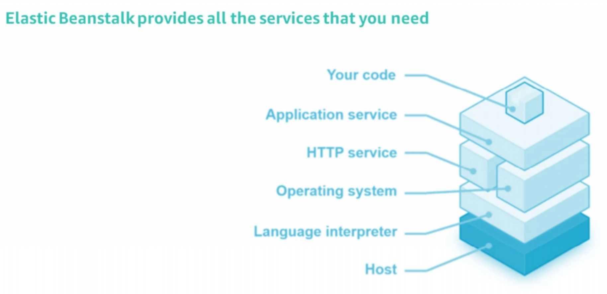

<!--

-->

#  AWS Elastic Beanstalk
### Week 8.3

---

# What you will Learn 

<v-clicks>

* Describe AWS Elastic beanstalk.  
* Explain components or layers in an Elastic Beanstalk.

</v-clicks>

---

# AWS Elastic Beanstalk

<v-clicks> 

* Elastic Beanstalk is an easy-to-use compute service for deploying and scaling web applications and services. 
* These applications and services are developed with Java, .NET, PHP, Node.js, Python, Ruby, Go, and Docker. 
* They are developed on familiar servers such as Apache, NGINX, Passenger, and Microsoft Internet Information Services (IIS).
* You upload your code, and Elastic Beanstalk automatically handles the deployment — including capacity provisioning, load balancing, automatic scaling, and application health monitoring.
* In addition, you retain full control over the AWS resources that power your application, and you can access the underlying resources at any time.  

</v-clicks>

---

# AWS Elastic Beanstalk

<v-clicks> 

* Elastic Beanstalk is a platform as a service (PaaS) that facilitates the quick deployment, scaling, and management of your applications. 
* You maintain control of your resources:
  * Choose your instance type
  * Choose your database
  * Set and adjust Amazon EC2 auto-scaling
  * Update your application 
  * Access server logs
  * Enable secure HHTP(S) on a load balancer 
  
</v-clicks>

---

# AWS Elastic Beanstalk

<v-clicks> 

* Elastic Beanstalk supports a range of platforms. Supported platforms include single container, multi-container, or pre-configured Docker; Go; JavaSE; Java with Tomcat; .NET on Microsoft Windows Server with Microsoft IIS; Node.js; PHP; Python; and Ruby.
* You can develop your application to meet your requirements and deploy it on Elastic Beanstalk. 
* Elastic Beanstalk is free of charge. You pay only for the underlying services that you use.
  
</v-clicks> 

---

# Elastic Beanstalk Components

<figure>
    
</figure>

---

# How Elastic Beanstalk Works

<v-clicks> 

* Elastic Beanstalk provides all the applications services that you need for your application. 
* You only need to create your code and deploy it. You can use the AWS Management Console, a Git repository, or an integrated development environment (IDE) to upload your application. 
* Then, Elastic Beanstalk automatically handles the deployment details of capacity provisioning, load balancing, automatic scaling, and application health monitoring.
* By using Elastic Beanstalk, you can focus on writing code instead of managing and configuring servers, databases, load balancers, firewalls, and networks. 
* Elastic Beanstalk provisions and operates the infrastructure and manages the application stack (platform) for you. 
* It keeps the underlying platform that runs your application up to date with the most recent patches and updates. 

</v-clicks>

---

# How Elastic Beanstalk Works

<v-clicks> 

* With Elastic Beanstalk, your application can handle peaks in workload or traffic while minimizing your costs. 
* It automatically scales your application up and down based on your application's needs by using adjustable Amazon EC2 Auto Scaling settings. 
* You can use CPU utilization metrics to trigger Amazon EC2 Auto Scaling actions. 
* When you must update your application after you deploy it, you only need to upload the new code.
* To learn more about Elastic Beanstalk, refer to [AWS Elastic Beanstalk](https://docs.aws.amazon.com/elastic-beanstalk/index.html).

</v-clicks>

---

# Key Takeaways

<v-clicks>

* AWS Elastic Beanstalk enhances developer productivity by simplifying the process of deploying your application, thus reducing management complexity. 
* Elastic Beanstalk is free of charge. You pay only for the services that you use.
* Elastic Beanstalk can help you get your applications up and running on AWS quickly. Upload your application code, and the service automatically handles all the details. It handles resource provisioning, load balancing, automatic scaling, and monitoring.
  
</v-clicks>
