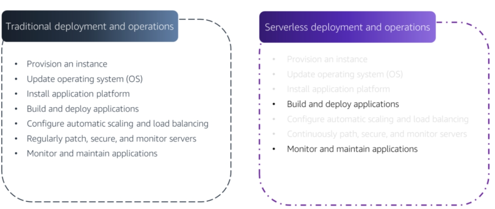
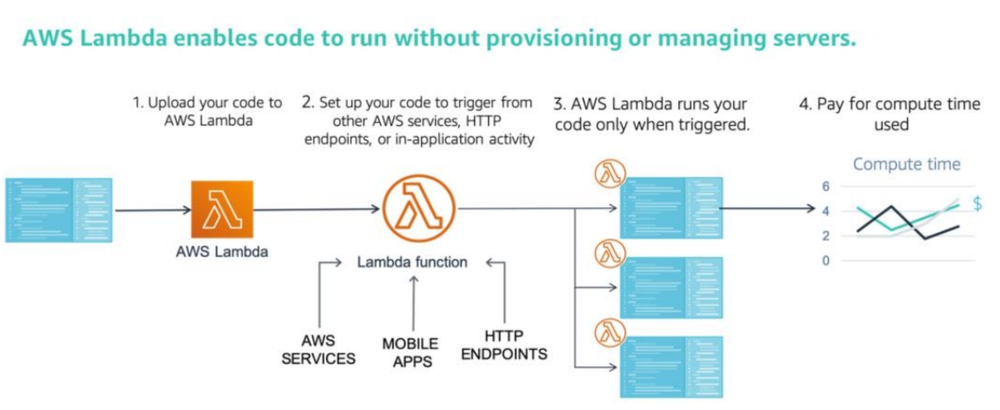
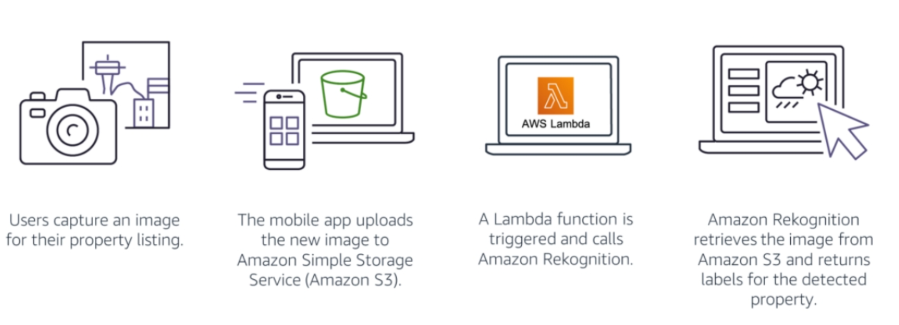
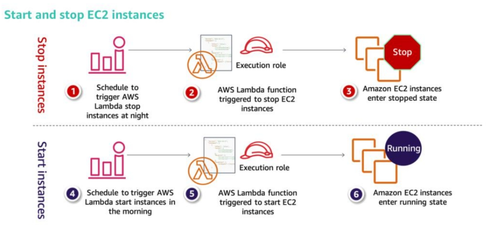
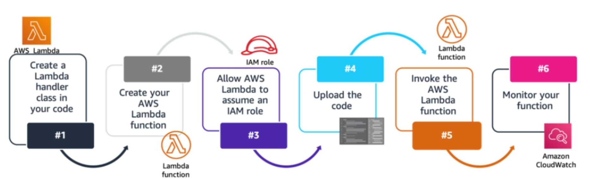

<!--

-->

# Serverless Computing - AWS Lambda
### Week 8.3

---

# What you will Learn 

<v-clicks>

* Discuss the concept of serverless computing  
* Explain the purpose of AWS Lambda 
* Explore the functions of AWS Lambda

</v-clicks>

---

# Serverless Computing 

<figure>
    
</figure>

---

# Serverless Computing

<v-clicks> 

* AWS offers many compute options; Amazon EC2 which provides virtual machines, container solutions, such as Amazon Elastic Container Service (Amazon ECS), and serverless solutions which do not require you to provision or manage servers. 
* Serverless computing enables you to build and run applications and services without thinking about servers. 
* Serverless applications do not require you to provision, scale, or manage any servers.
  
</v-clicks>

---

# AWS Lambda

<v-clicks> 

* AWS provides serverless computing through the AWS Lambda service. 
* You can create Lambda functions for nearly any type of application or backend service. 
* Everything that is needed to run and scale your application with high availability is handled for you.
* Lambda offers fully managed, serverless compute services that run your code only when needed, and it scales automatically to thousands of requests per second.
* With Lambda, you can run code for virtually any type of application or backend service—all with minimal administration.
* You only need to upload your code, and Lambda handles everything that is required to run and scale your code with high availability. 
  
</v-clicks> 

---

# AWS Lambda

<figure>
    
</figure>

<v-clicks> 

* You can set up your code to automatically trigger from other AWS services, or you can call it directly from any web or mobile application.
* The running time of a Lambda function is limited to a maximum of 15 minutes.  

</v-clicks>

---

# AWS Lambda

<v-clicks>

* AWS Lambda lets you run code without provisioning or managing servers. 
* Run code for virtually any type of application or backend service. Upload your code, and Lambda takes care of everything that is required to run and scale your code with high availability.
* Configure your code so that other AWS services automatically trigger it, or invoke your code directly from any web or mobile application.
* Pay only for the compute time that you consume – you pay nothing when your code is not running.
* AWS Lambda supports multiple programming languages, such as Java, Node.js, C#, Python, and Ruby.

</v-clicks>

---

# Lambda Use Cases

AWS Lambda and S3 object upload
<figure>
    
</figure>

---

# Lambda Use Cases

AWS Lambda and Cloudwatch Events
<figure>
    
</figure>

---

# Lambda Use Cases

<v-clicks>

* Some other Lambda use cases include: 
* Automated backups. 
* Processing objects that are uploaded to Amazon S3. 
* Event-driven log analysis.
* Event-driven transformations Internet of Things (IoT).
* Operating serverless websites.

</v-clicks>

---

# Steps to Deploy AWS Lambda 

<figure>
    
</figure>

---

# Steps to Deploy AWS Lambda

<v-clicks>

* The process of developing and deploying an AWS Lambda function with dependencies includes:
* Define a Lambda handler class in your code. 
  * The handler enables you to specify where AWS Lambda can begin running your code. You can learn more about Lambda handlers [here](https://docs.aws.amazon.com/lambda/latest/dg/python-handler.html)
* Create your AWS Lambda function. 
  * You can think of the function as the code that you want to run. 
  * It includes your code, associated configuration information, and resource requirements.
* Configure access to resources with AWS Identity and Access Management (IAM) and IAM roles. 
  * You can use security groups and network access control lists (network ACLs) to provide your functions with access to your resources.

</v-clicks>

---

# Steps to Deploy AWS Lambda

<v-clicks>

* Upload your code. 
* Test the function, verify results, and review your logs.
* Monitor your Lambda functions and report metrics through Amazon CloudWatch. 
  * Examples of what you can track include the number of requests, latency, and the number of requests that result in errors. 

</v-clicks>

---

# AWS Lambda Quotas 

<v-clicks> 

* AWS Lambda does limit the amount of computing and storage resources that you can use to run and store functions.
* The maximum memory allocation for a single Lambda function is 10 GB. 
* Lambda also has limits on deployment package size - 50 MB for zipped files, and 250 MB for unzipped ones. 
* If you are troubleshooting a Lambda deployment, keep these limits in mind.
* New AWS accounts have reduced concurrency and memory quotas.
* AWS raises these quotas automatically based on your usage.
* For the current AWS Lambda limits, refer to the documentation on [AWS Lambda quotas](https://docs.aws.amazon.com/lambda/latest/dg/gettingstarted-limits.html).

</v-clicks>

---

# Key Takeaways

<v-clicks>

* Serverless computing enables you to build and run applications and services without provisioning or managing servers.
* AWS Lambda provides built-in fault tolerance and automatic scaling. 
* The maximum memory allocation for a single Lambda function is 10 GB.  
* The maximum execution time for a Lambda function is 15 minutes.
  
</v-clicks>
