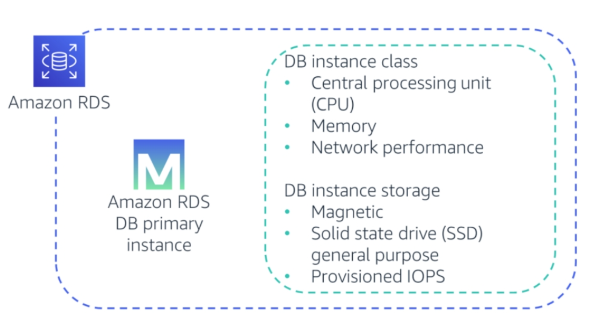
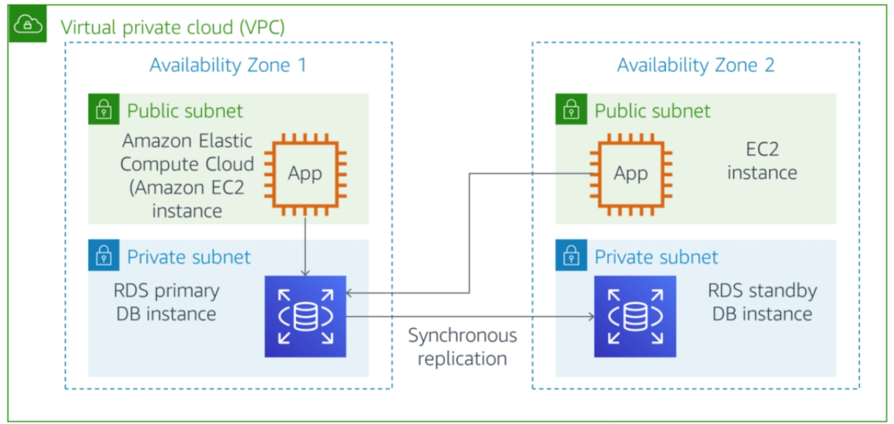
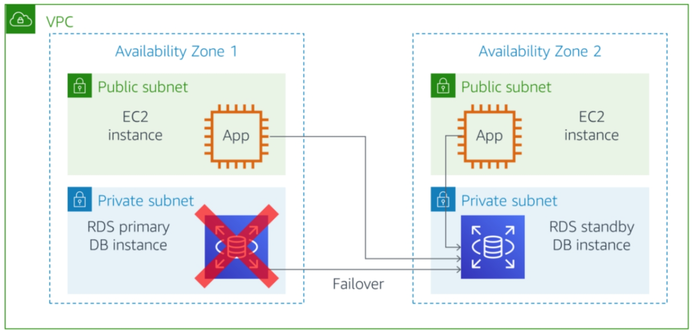
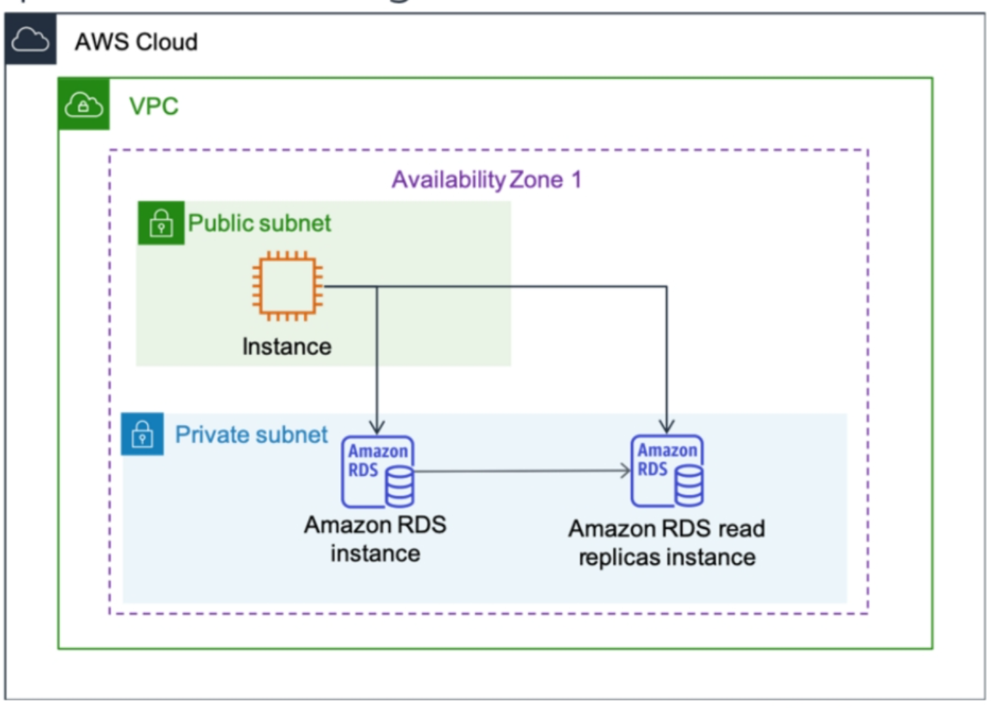

<!--

-->

#  Amazon Relational Database Service 

Week 6.5

---

# What you will Learn 

<v-clicks>

*  Give an overview of Amazon RDS 
*  Describe some of the options that Amazon RDS offers 
*  Explore Amazon RDS backup options 
*  Explain the six database types on Amazon RDS 
*  Establish high availability, which Amazon RDS offers  
*  Examine a few uses cases for Amazon RDS

</v-clicks>

---

# Introduction to Amazon RDS

<v-clicks> 

* Amazon Relational Database Service (Amazon RDS) is a collection of managed services that makes it simple to set up, operate, and scale databases in the cloud.
* Running an unmanaged, standalone relational database can be time-consuming and have limited scope. 
* To address these challenges, AWS provides a service that sets up, operates, and scales the relational database without any ongoing administration. 
* Amazon RDS provides cost-efficient and resizable capacity while automating time-consuming administrative tasks.
* Amazon RDS frees you to focus on your application so you can give the applications the performance, high availability, security, and compatibility that they need. 
* With Amazon RDS, your primary focus is your data and optimizing your application.

</v-clicks>

---

# Introduction to Amazon RDS

<v-clicks> 

* It supports seven popular engines - [Amazon Aurora with MySQL compatibility](https://aws.amazon.com/rds/aurora/?pg=ln&sec=hiw), [Amazon Aurora with PostgreSQL compatibility](https://aws.amazon.com/rds/aurora/?pg=ln&sec=hiw), [MySQL](https://aws.amazon.com/rds/mysql/?pg=ln&sec=hiw), [MariaDB](https://aws.amazon.com/rds/mariadb/?pg=ln&sec=hiw), [PostgreSQL](https://aws.amazon.com/rds/postgresql/?pg=ln&sec=hiw), [Oracle](https://aws.amazon.com/rds/oracle/?pg=ln&sec=hiw), and [SQL Server](https://aws.amazon.com/rds/sqlserver/?pg=ln&sec=hiw) — and deploy on-premises with [Amazon RDS on AWS Outposts](https://aws.amazon.com/rds/outposts/?pg=ln&sec=hiw).

</v-clicks>

---

# Amazon RDS DB Instances

<figure>
  

    
  

</figure>

<v-clicks> 

* The basic building block of Amazon RDS is the DB instance. 
* A DB instance is an isolated database environment. 
* It can contain multiple user-created databases and can be accessed by using the same tools and applications that you use with a standalone database instance. 
  
</v-clicks>

---

# Amazon RDS DB Instances

<figure>
  

    
  

</figure>

<v-clicks> 

* The resources in a database instance are determined from its database instance class, and the type of storage is determined by the type of disks.
* Database instances and storage differ in performance characteristics and price, which enable you to customize your performance and cost to the needs of your database. 
* When you choose to create a DB instance, you must first specify which database engine to run. 
  
</v-clicks>

---

# Amazon RDS Backup

<v-clicks> 

* Because Amazon RDS is a fully managed service, one task that it automatically performs is the periodic backup of a DB instance. 
* The entire instance is backed up to a storage volume snapshot during a specified backup window. 
* It is retained according to a specified backup retention period. 
* The first snapshot of a DB instance contains the full data. 
* Subsequent snapshots are incremental and contain only the data that changed since the most recent snapshot.
* Optionally, you can back up a database instance manually by creating a snapshot.
* For more information about working with backups, see [Backing up and restoring an Amazon RDS DB instance](https://docs.aws.amazon.com/AmazonRDS/latest/UserGuide/CHAP_CommonTasks.BackupRestore.html).

</v-clicks>

---

# High Availability with Amazon RDS

<figure>
    
</figure>

<v-clicks>

* You can configure a database instance with high availability by using a Multi-AZ deployment. 
* This configuration automatically generates a standby copy of the database instance in another Availability Zone in the same virtual private cloud (VPC). 

</v-clicks>

---

# High Availability with Amazon RDS

<figure>
    
</figure>

<v-clicks>

* After you make the initial full copy, transactions are synchronously replicated to the standby copy. 
* Running a database in multiple Availability Zones can enhance availability during planned system maintenance. 
* It can also help protect your database against database failure and disruptions to Availability Zones.

</v-clicks>

---

# High Availability with Amazon RDS: Failover

<figure>
    
</figure>

<v-clicks>

* If the primary database instance fails, Amazon RDS automatically brings the standby database instance online as the new primary instance. 
* Requests from both applications are then directed to the new primary instance. 

</v-clicks>

---

# High Availability with Amazon RDS: Failover

<figure>
    
</figure>

<v-clicks>

* The requesting applications use the Amazon RDS Domain Name System (DNS) endpoint to reference the database by name. 
* As a result, the failover happens without needing to change the application code. 
* No data loss occurs because of the synchronous replication.

</v-clicks>

---

# Amazon RDS Read Replicas and Scaling 

<figure>
    
</figure>

---

# Amazon RDS Read Replicas and Scaling 

<v-clicks> 

* Amazon RDS read replicas provide enhanced performance and durability for RDS DB instances. 
* They make it easy to elastically scale out beyond the capacity constraints of a single DB instance for read-heavy database workloads. 
* Updates to the source DB instance are asynchronously copied to the read replica instance. 
* You can reduce the load on your source DB instance by routing read queries from your applications to the read replica. 
* Read replicas can be promoted to become the primary DB instance. 
* However, because it uses asynchronous replication, this option requires manual action.

</v-clicks>

---

# Amazon RDS Read Replicas and Scaling 

<v-clicks> 

* Read replicas can be created in a different Region from the primary DB instance. 
* This feature can help satisfy disaster recovery (DR) requirements or reduce latency by directing reads to a read replica in a geographic area that is closer to the user.
* For more information see [Amazon RDS Read Replicas](https://aws.amazon.com/rds/features/read-replicas/)

</v-clicks>

---

# Scaling your Amazon RDS Instance 

<v-clicks> 

* As discussed earlier, Amazon RDS takes care of scaling your relational database so your database can keep up with the increasing demands of your applications.
* You can scale your RDS instance **vertically** by adding more capacity to the storage and computing of your current RDS instance. 
* Or scale **horizontally** by adding additional RDS instances for reads and writes.

</v-clicks>

---

# Vertical Scaling

<v-clicks> 

* Vertical scaling is the most straightforward approach to adding more capacity to your database. 
* Vertical scaling is suitable if you can’t change your application and database connectivity configuration. 
* You can vertically scale up your RDS instance with a click of a button. 
* Several instance sizes are available, from general-purpose to CPU and memory-optimized.
*  Instance types have combinations of CPU, memory, storage, and networking capacity, and give you the flexibility to choose the appropriate mix of resources for your database. 
*  In addition, each instance type includes several instance sizes, which allows you to scale your database to the requirements of your target workload.
* For more information about DB instance classes, see [DB instance classes](https://docs.aws.amazon.com/AmazonRDS/latest/UserGuide/Concepts.DBInstanceClass.html).

</v-clicks>

---

# Horizontal Scaling

<v-clicks> 

* Horizontal scaling increases performance by extending the database operations to additional nodes. 
* You can choose this option if you need to scale beyond the capacity of a single DB instance. 
* An advantage of horizontally scaling in Amazon RDS is that AWS handles the infrastructure management, provisioning, and configuration of additional nodes. 
* You can easily create additional nodes from the Amazon RDS console or API.

</v-clicks>

---

# When to use Amazon RDS 

| **When to use Amazon RDS**  | **When NOT to use Amazon RDS**  | 
|--------------|-----|
| Your aplication requires complex transactions or complex queries|  Simple GET or PUT requests and queries that a NoSQL database can handle | 
| Build highly durable database solutions  |  Relational database management system (RDBMS) customization |         

<v-clicks> 

* For circumstances where you should not use Amazon RDS, you can use a NoSQL database solution, such as DynamoDB. 
* Another alternative to Amazon RDS is to run your relational database engine on Amazon EC2 instances, which will provide more options for customizing your database.

</v-clicks>

---

# Amazon RDS Best Practices

<v-clicks>

* Some recommended practices for RDS include:
* Enable automatic backups, and set the backup window to occur during a time when you have minimal write operations to the database.
* If you use a Multi-AZ deployment, test the failover for your DB instance to understand how long it takes to complete the switch-over. 
* Verify that your application can successfully access the new primary DB instance.
* For more information about best practices for Amazon RDS, see [Best practices for Amazon RDS](https://docs.aws.amazon.com/AmazonRDS/latest/UserGuide/CHAP_BestPractices.html).

</v-clicks>

---

# Amazon RDS Use Cases

<v-clicks>

* Amazon RDS works well for web and mobile applications that need a database with high throughput, extensive storage scalability, and high availability. 
* Because Amazon RDS does not have any licensing constraints, it fits the variable usage pattern of these applications. 
* For small and large e-commerce businesses, Amazon RDS provides a flexible, secured, and low-cost database solution for online sales and retailing. 
* Amazon RDS manages the database infrastructure, so developers do not need to worry about provisioning, scaling, or monitoring database servers.

</v-clicks>

---

# Key Takeaways

<v-clicks>

* Amazon RDS is a database service that makes it easy to set up, operate, and scale a relational database in the cloud.
* As a managed service, Amazon RDS is accessible by using the console, the AWS CLI, or application programming interface (API) calls.
* Amazon RDS offers features for automated redundancy and backups.
* Amazon RDS supports an array of database engines, which includes Amazon Aurora, PostgreSQL, MySQL, MariaDB, Oracle Database, and Microsoft SQL Server.

</v-clicks>
