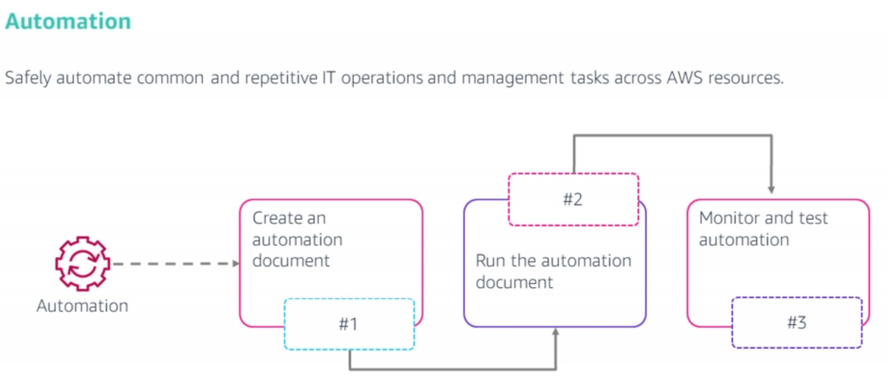
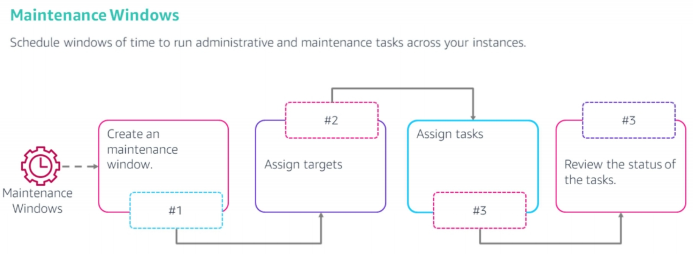
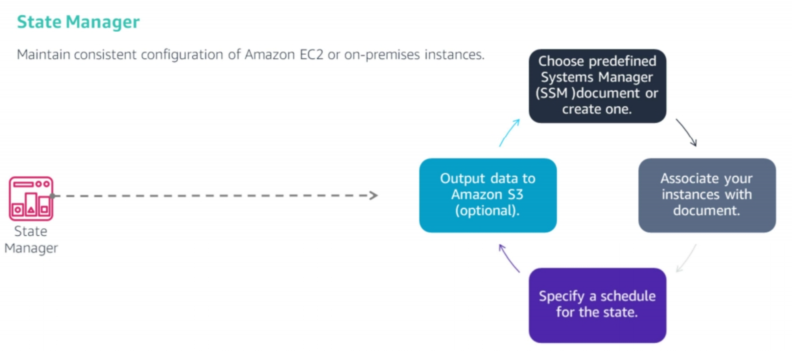

<!--

-->

#  AWS Systems Manager
### Week 8.1

---

# What you will Learn 

<v-clicks>

* Describe details about AWS Systems Manager.  
* Highlight the features of AWS Systems Manager.

</v-clicks>

---

# AWS Systems Manager

<v-clicks> 

* AWS Systems Manager is a collection of capabilities to help you manage your applications and infrastructure for AWS and on-premises resources. 
* Systems Manager is designed to be highly automation-focused, which enables the configuration and management of systems that run on-premises or in AWS. 
* It helps with:
  * Improving visibility and control in the cloud, on-premises, and at the edge.
  * Shortening the time to detect and resolve operational issues.
  * Maintaining instance compliance against your patch, configuration, and custom policies.
  * Automating configuration and ongoing management of your applications and resources.

</v-clicks>

---

# AWS Systems Manager Features

**Systems Manager groups feature into the following categories:**

<v-clicks> 

* Change management.
  * Automation 
  * Change Manager
  * Maintenance Windows
* Operations management.
  * Incident Manager
  * Explorer
  * OpsCenter
  * CloudWatch dashboards
  
</v-clicks>

---

# AWS Systems Manager Features

**Systems Manager groups feature into the following categories:**

<v-clicks> 

* Application management.
  * Application Manager
  * AppConfig
  * Parameter Store
* Node management.
  * Run command             
  * Session Manager
  * Patch Manager
  * State Manager
  * Inventory
* We would discuss some of these features in the next slides.
  
</v-clicks> 

---

# AWS Systems Manager Feature: Automation 

<figure>
    
</figure>

---

# AWS Systems Manager Feature: Automation

<v-clicks> 

* The Automation feature in Systems Manager enables you to define common IT tasks as a collection of steps in an AWS Systems Manager document (SSM document). 
* The Automation feature can then run all the document steps on an entire collection of AWS resources. 
* For example, you could define automation as remediating unreachable instances or patch instances. 
* Custom automation can also be authored in JavaScript Object Notation (JSON). 
* Amazon CloudWatch Events can also be configured to trigger Systems Manager automation.

</v-clicks>

---

# AWS Systems Manager Feature: Automation

**A suggested approach to developing and testing a Systems Manager automation is to:**

<v-clicks>

* Create an automation document — or use an existing automation template — that includes sequential steps and parameters that the Systems Manager runs.
* Run the automation by using Systems Manager, which can: 
  * Launch an instance 
  * Take a snapshot 
  * Tag instances 
  * Delete old images 
  * Terminate an instance
* Monitor the automation workflow after the automation finishes, and confirm that the expected results were achieved. For example, you could launch a test instance from an AMI that was updated by a Systems Manager automation to verify that it has the expected characteristics.

</v-clicks>

---

# AWS Systems Manager Feature: Maintenace Windows

<figure>
    
</figure>

<v-clicks>

* The Systems Manager Maintenance Windows feature enables a user to schedule regular tasks — such as patching — to run automatically.
* A user can set limits for simultaneous task runs and allowable error rates.

</v-clicks>

---

# AWS Systems Manager Feature: Maintenace Windows

**The steps to implement a Maintenance Window are:**

<v-clicks>

* Create a Maintenance Window. 
* Assign targets.
* Assign tasks to be run on those targets. Types of tasks that can run include: 
  * Commands run by Systems Manager Run Command 
  * Systems Manager Automation workflows 
  * AWS Step Functions workflows 
  * AWS Lambda functions
* Review the status of the tasks after the tasks are completed.

</v-clicks>

---

# AWS Systems Manager Feature: Parameter Store 

<v-clicks>

* Instead of storing sensitive data in configuration files or hardcoding them into source code, you can use the Systems Manager Parameter Store to store these parameters. 
* Parameter Store provides secure, hierarchical storage for configuration data and secret management. 
* You can store data such as passwords, database strings, Amazon EC2 instance IDs and Amazon Machine Image (AMI) IDs, and license codes as parameter values.
* Values can be stored as plain text or encrypted with AWS KMS. 
* You can then reference values by using the unique name you specified when you created the parameter.

</v-clicks>

---

# AWS Systems Manager Feature: State Manager

<figure>
    
</figure>

<v-clicks>

* AWS Systems Manager State Manager is a secure and scalable configuration management service that automates the process of keeping your EC2 and hybrid infrastructure in a state that you define.

</v-clicks>

---

# AWS Systems Manager Feature: State Manager

<v-clicks>

* A managed node is any machine configured for Systems Manager.
* Systems Manager supports Amazon EC2 instances, edge devices, and on-premises servers or virtual machines (VMs), including VMs in other cloud environments.
* You can use State Manager to guarantee that your managed nodes are bootstrapped with specific software at startup, joined to a Windows domain, or patched with specific software updates.
* First, create an AWS Systems Manager (SSM) document or identify an existing one that defines the actions that Systems Manager will perform on your managed nodes. 
* Next, associate your managed nodes with the SSM document. When you create the association, you define the schedule for how often to apply the configured state. 
* Finally, you can choose to write the output of the commands to an Amazon S3 bucket when you create an association. 

</v-clicks>

---

# AWS Systems Manager Feature: Run Command 

<v-clicks> 

* Use Run Command to remotely and securely manage the configuration of your managed nodes at scale.
* It provides a simple way to run predefined commands against managed nodes. 
* It simplifies making on-demand changes such as updating applications or running Linux shell scripts and Windows PowerShell commands on a target set of dozens or hundreds of managed nodes.
* A command that is run by Run Command reduces management overhead because a user can manage nodes without setting up bastion hosts or managing Secure Shell (SSH) keys and certificates.
* Through integration with AWS IAM, you can apply granular permissions to control the actions that users can perform on instances. 
* All actions that are taken with Systems Manager can also be recorded by AWS CloudTrail, which enables a user to audit changes throughout their environment.

</v-clicks>

---

# AWS Systems Manager Feature: Session Manager 

<v-clicks> 

* The Session Manager feature in Systems Manager enables a user to manage edge devices and EC2 instances through an interactive browser-based shell in the AWS Management Console.
* Session Manager provides secure and auditable instance management without the need to open inbound ports in the security groups, maintain bastion hosts, or manage Secure Shell (SSH) keys.
* It also makes it straightforward to comply with corporate policies that require controlled access to instances, strict security practices, and auditable logs that contain instance access details. 
* These benefits can be gained while still providing access to EC2 instances to end-users.

</v-clicks>

---

# AWS Systems Manager Feature: Patch Manager 

<v-clicks> 

* Use Patch Manager to automate the process of patching your managed nodes with both security-related and other types of updates. 
* You can use Patch Manager to apply patches for both operating systems and applications. 
* This capability allows you to scan managed nodes for missing patches and apply missing patches to large groups of managed nodes using tags. 
* Patch Manager uses patch baselines, which can include rules for auto-approving patches within days of their release, and a list of approved and rejected patches. 
* You can install security patches regularly by scheduling patching to run as a Systems Manager maintenance window task, or you can patch your managed nodes on demand at any time.

</v-clicks>

---

# AWS Systems Manager Feature: Patch Manager 

**To use the Systems Manager Patch Manager to automate patching:**

<v-clicks> 

* Create a patch baseline, which contains rules that automatically approve or reject patches.
* Define a maintenance window, and group instances together for patching.
* Apply patches in the maintenance window, and reboot every instance in the patch group.
* Review the results and the details of patch compliance.

</v-clicks>

---

# AWS Systems Manager Feature: Inventory 

<v-clicks>

* The Systems Manager Inventory feature can collect inventory information about your managed nodes and the software installed on them, such as; application data, network configurations, files, updates, system properties and more.
* It provides a comprehensive understanding of the system configurations and installed applications across multiple nodes, without the need to log in to each node individually.
* The gathered data supports managing application assets, tracking licenses, monitoring file integrity, discovering applications that were not installed by a traditional installer, and more.

</v-clicks>

---

# Key Takeaways

<v-clicks>

* Systems Manager enables you to safely automate common and repetitive IT operations and management tasks across AWS and on-premise resources.
* Systems Manager provides a suite of features that help automate operational tasks across AWS and on-premises resources.
* Patch Manager and Maintenance Window features could be used to apply operating system patches based on a predefined schedule.
  
</v-clicks>
