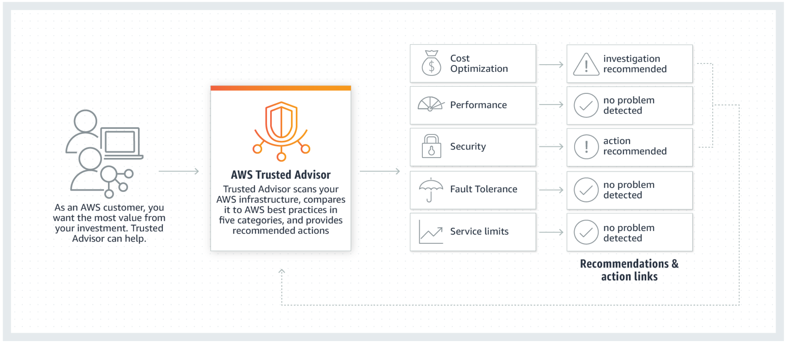
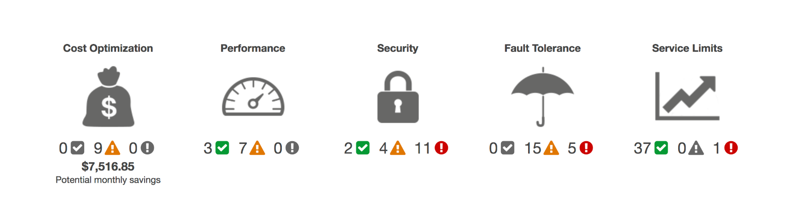

<!--

-->

# AWS Trusted Advisor
### Week 6.2

---

# What you will Learn 

<!-- global-top.vue -->

<v-clicks>

* Describe AWS Trusted Advisor.
* Explore the five categories of recommendations produced by Trusted Advisor.
* Highlight the features of Trusted Advisor.
* Interpret Trusted Advisor recommendations.

</v-clicks>

---

# Introduction to AWS Trusted Advisor

<v-clicks> 

* AWS Trusted Advisor provides recommendations that help you follow AWS best practices. 
* Trusted Advisor evaluates your account by using checks. 
* These checks identify ways to optimize your AWS infrastructure, improve security and performance, reduce costs, and monitor service quotas. 
* You can then follow the check recommendations to optimize your services and resources.
* It provides best practices (or checks) in five categories:
* **Cost Optimization** – How you can save money on AWS by reducing unused and idle resources, or making commitments to reserved capacity.
* **Performance** – Improve the performance of your service by checking your service ff, ensuring that you take advantage of provisioned throughput, and monitoring for overutilized instances.
* **Security** – Improve the security of your application by closing gaps, enabling various AWS security features, and examining your permissions.

</v-clicks>

---

# Introduction to AWS Trusted Advisor

<figure>
  
</figure>

<v-clicks> 

* **Fault Tolerance** – Increase the availability and redundancy of your AWS application by taking advantage of automatic scaling, health checks, multiple Availability Zones, and backup capabilities.
* **Service Quotas** – Service quotas are the maximum number of resources that you can create in an AWS account. Trusted Advisor will notify you once you reach more than 80% of a service quota. 

</v-clicks>

---

# Introduction to AWS Trusted Advisor

<figure>
  
</figure>

<v-clicks> 

* The status of the check is shown by using color-coding on the dashboard page: 
* **Red** (red exclamation mark) – Action is recommended. 
* **Yellow** (yellow exclamation mark) – Investigation is recommended. 
* **Green** (green checkmark) – No problem has been detected.

</v-clicks>

---

# Using AWS Trusted Advisor

<v-clicks>

* AWS Trusted Advisor provides popular performance and security recommendations to all AWS customers. The following Trusted Advisor checks are available to all customers at no cost:
  -  Service quotas 
  -  Security groups – Specific ports unrestricted 
  -  AWS Identity and Access Management (IAM) use  
  -  Multi-factor authentication (MFA) on the root account  
  -  Amazon Elastic Block Store (Amazon EBS) public snapshots 
  -   Amazon Relational Database Service (Amazon RDS) public snapshots
* The complete set of checks and guidance is available with Business Support and Enterprise Support plans. 
* AWS Trusted Advisor helps you to provision your resources by following best practices. 
* Using this capability, you can improve system performance and reliability, increase security, and look for opportunities to save money.
<!-- * For a complete list of checks and descriptions, see the [Trusted Advisor Best Practices](https://aws.amazon.com/premiumsupport/technology/trusted-advisor/best-practice-checklist/). -->
  
</v-clicks>

---

# Trusted Advisor Features

<v-clicks>

* AWS Trusted Advisor provides a suite of features so you can customize recommendations and proactively monitor your AWS resources:
* **Trusted Advisor Notifications** – Stay up to date with your AWS resource deployment. You will be notified by a weekly email message when you use this service.
* **AWS Identity and Access Management (IAM)** – Control access to specific checks or check categories.
* **AWS Support application programming interface (API)** – Retrieve and refresh Trusted Advisor results programmatically.
* **Action Links** – Hyperlinks on items in a Trusted Advisor report that take you directly to the console. From the console, you can implement the Trusted Advisor recommendations.
* **Recent Changes** – Track recent changes in check status on the console dashboard. The most recent changes appear at the top of the list to bring them to your attention.
  
</v-clicks>

---

# Trusted Advisor Features

<v-clicks> 

* **Exclude Items** – Customize the Trusted Advisor report. You can exclude items from the check result if they are not relevant.
* **Refresh All** – Refresh individual checks or refresh all the checks at once by selecting Refresh All in the top-right corner of the summary dashboard. A check is eligible for a 5-minute refresh after it was last refreshed.

</v-clicks>

---

# Key Takeaways

<v-clicks>

* AWS Trusted Advisor is an online tool that provides real-time guidance to help you provision, optimize, and secure your resources by following AWS best practices.
* Examples of Trusted Advisor security checks and advice include:    
  - Making sure that security groups do not keep ports open with unrestricted access.
  - Checking for your use of AWS Identity and Access Management (IAM) permissions to control access to AWS resources.
  - Checking the root account and warning if multi-factor authentication (MFA) is not enabled.
  - Checking that logging is enabled on Amazon Simple Storage Service (Amazon S3) buckets

</v-clicks>
