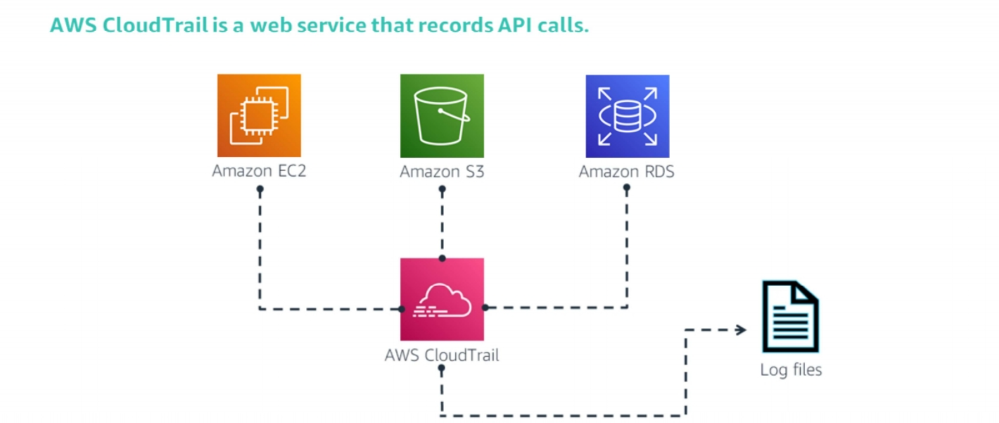
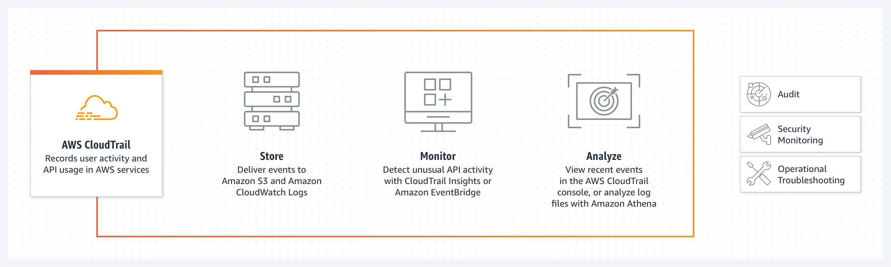
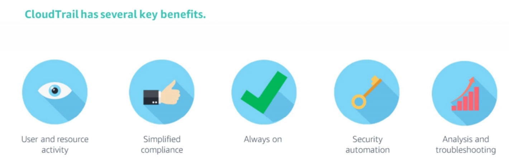

<!--

-->

# AWS CloudTrail
### Week 5.3

---

# What you will Learn 

<!-- global-top.vue -->

<v-clicks>

* Describe the value of AWS CloudTrail.
* Hightlight the features of AWS CloudTrail.
* Understand differences between Managed events, Data events and Insights events.

</v-clicks>

---

# Introduction to AWS CloudTrail

<figure>
  
</figure>

<v-clicks> 

* AWS CloudTrail is a web service that records AWS application programming interface (API) calls for your account and delivers log files to you.
* CloudTrail logs the API calls that are made in an AWS account across AWS Regions. It does so whether that action was performed using the AWS Command Line Interface (AWS CLI), a software development kit (SDK), the console, or directly through an API.

</v-clicks>

---

# Introduction to AWS CloudTrail

<figure>
  
</figure>

<v-clicks> 

* CloudTrail is a crucial tool for simplifying governance, compliance, and operational and risk auditing since everything in AWS is an API call. 
* Actions taken by a user, role, or an AWS service are recorded as events in CloudTrail. Events include actions taken in the AWS Management Console, AWS Command Line Interface, and AWS SDKs and APIs.

</v-clicks>

---

# Introduction to AWS CloudTrail

<v-clicks> 

* The service logs include actions such as: 
  - Starting and stopping instances 
  - Creating or modifying Amazon Relational Database Service (Amazon RDS) databases
  - Uploading a file to Amazon Simple Storage Service (Amazon S3)
 
* CloudTrail is enabled on your AWS account when you create it. When activity occurs in your AWS account, that activity is recorded in a CloudTrail event.
  
 * Visibility into your AWS account activity is a key aspect of security and operational best practices. You can use CloudTrail to view, search, download, archive, analyze, and respond to account activity across your AWS infrastructure. 

</v-clicks>

---

# AWS CloudTrail Benefits

<figure>
  
</figure>

CloudTrail has several key benefits:

<v-clicks> 

* It increases your visibility into user and resource activity. With this visibility, you can identify who did what and when in your AWS account.

</v-clicks>

---

# AWS CloudTrail Benefits

<figure>
  
</figure>

CloudTrail has several key benefits:

<v-clicks> 

* Compliance audits are simplified because activities are automatically recorded and stored in event logs. The logging of activities enables you to search through log data, identify actions that are noncompliant, accelerate investigations into incidents, and then expedite a response.
* Because you are able to capture a comprehensive history of changes that are made in your account, you can analyze and troubleshoot operational issues in your account.

</v-clicks>

---

# How CloudTrail works

<v-clicks>

* An activity happens in your account.
* CloudTrail captures and records that activity, which is referred to as a **CloudTrail event**. The event contain details about the following: 
  - Who performed the request 
  - Date and time of the request 
  - Source Internet Protocol (IP) address 
  - How the request was made 
  - Action performed 
  - Region where the action was taken 
  - Response  
* By default, the logs are stored for 7 days. You can send the activity log to other AWS services. Therefore, you can retain the activity history for as long as you want.  
  
</v-clicks>

---

# CloudTrail Events

<v-clicks>

* An event in CloudTrail is the record of an activity in an AWS account. This activity can be an action taken by a user, role, or service that is monitorable by CloudTrail.
* CloudTrail events provide a history of account activity made through the AWS Management Console, AWS SDKs, AWS CLI, and other AWS services. 
* There are three types of events that can be logged in CloudTrail
  - Management events.
  - Data Events.
  - CloudTrail insights events.
* By default, trails log management events, but not data or insights events.
* CloudTrail does not log all AWS services and all events. For more information about which APIs are logged for a specific service, see [here](https://docs.aws.amazon.com/awscloudtrail/latest/userguide/cloudtrail-aws-service-specific-topics.html).
  
</v-clicks>

---

# Management Events

<v-clicks>

* Management events provide information about management operations that are performed on resources in your AWS account.
* Examples of management events include:
  - Configuring security (for example, AWS IAM `AttachRolePolicy` API operations).
  - Registering devices (for example, Amazon EC2 `CreateDefaultVpc` API operations).
  - Configuring rules for routing data (for example, Amazon EC2 `CreateSubnet` API operations).
  - Setting up logging (for example, AWS CloudTrail `CreateTrail` API operations).
* Management events can also include non-API events that occur in your account. For example, when a user signs in to your account.
  
</v-clicks>

---

# Data Events

<v-clicks>

* Data events provide information about the resource operations performed on or in a resource. 
* Examples of recorded data events include:
  - Amazon S3 object-level API activity (for example, `GetObject`, `DeleteObject`, and `PutObject` API operations) on buckets and objects in buckets. 
  - Amazon DynamoDB object-level API activity on tables (for example, `PutItem`, `DeleteItem`, and `UpdateItem` API operations).
  - Amazon Elastic Block Store (EBS) direct APIs, such as `PutSnapshotBlock`, `GetSnapshotBlock`, and `ListChangedBlocks` on Amazon EBS snapshots.
* Data events are not logged by default when you create a trail. To record CloudTrail data events, you must explicitly add to a trail the supported resources or resource types for which you want to collect activity.
* For more information, see [Creating a trail](https://docs.aws.amazon.com/awscloudtrail/latest/userguide/cloudtrail-create-a-trail-using-the-console-first-time.html), [Data events](https://docs.aws.amazon.com/awscloudtrail/latest/userguide/logging-data-events-with-cloudtrail.html#logging-data-events) and [AWS CloudTrail pricing](https://aws.amazon.com/cloudtrail/pricing/).
  
</v-clicks>

---

# Insights Events

<v-clicks>

* CloudTrail Insights events record unexpected API call rates or error rates in your AWS account. 
* Insights events are logged to a different folder in the destination S3 bucket for your trail if you have insights events enabled and CloudTrail detects unexpected activity. 
* When viewing insights events on the CloudTrail console, you can now see the type of insight and the incident time period. Insights events give you useful information like the associated API, problem code, incident time, and statistics to help you understand and respond to anomalous behaviour.
* Unlike other types of events captured in a CloudTrail trail, insights events are logged only when CloudTrail detects changes in your account's API usage or error rate logging that differ significantly from the account's typical usage patterns.
  
</v-clicks>

---

# Insights Events

<v-clicks>

* Examples of activity that might generate Insights events include:
  - Your account typically logs no more than 20 Amazon S3 `deleteBucket` API calls per minute, but your account starts to log an average of 100 `deleteBucket` API calls per minute. An insights event is logged at the start of the unusual activity, and another insights event is logged to mark the end of the unusual activity.
  - Your account typically logs less than one `AccessDeniedException` error in a seven-day period on the AWS Identity and Access Management API, `DeleteInstanceProfile`. Your account starts to log an average of 12 `AccessDeniedException` errors per minute on the `DeleteInstanceProfile` API call. An Insights event is logged at the start of the unusual error rate activity, and another insights event is logged to mark the end of the unusual activity.
* The examples provided above are for illustration purposes only. Your results may vary depending on your use case
  
</v-clicks>

---

# Trails 

<v-clicks>

* A trail is a configuration that enables delivery of CloudTrail events to an Amazon S3 bucket, CloudWatch Logs, and CloudWatch Events. 
* Trails can be used to filter the CloudTrail events you want delivered, encrypt your CloudTrail event log files with an AWS KMS key, and set up Amazon SNS notifications for log file delivery.
  
</v-clicks>

---

# Best Practices

<v-clicks>

* Turn on CloudTrail log file validation. This validates the integrity of log files by detecting whether they were changed or deleted. 
* Aggregate log files a S3 bucket.
* Ensure that CloudTrail is enabled across AWS globally. This ensures that your settings are applied consistently across all existing and newly launched regions.
* Restrict access to AWS CloudTrail buckets.
* Integrate with Amazon Cloudwatch. This enables you to define actions to run when CloudTrail logs specific events.

</v-clicks>

---

# Key Takeaways

<v-clicks>

* AWS CloudTrail logs the API calls made in an AWS account across Regions, whether that action was performed using the CLI, an SDK, the console, or directly through an API.
* The information logged by AWS CloudTrail gives visibility into user and resource activity. By using this information, you can identify who did what and when in your account.
* Because everything in AWS is an API call, CloudTrail simplifies governance, compliance, and risk auditing.

</v-clicks>

