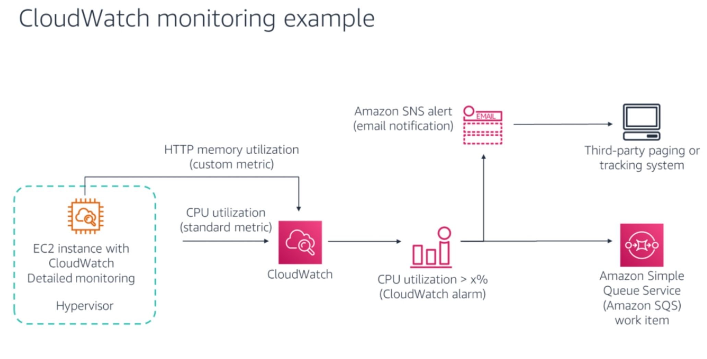

<!--

-->

# Amazon CloudWatch
### Week 5.4

---

# What you will Learn 

<!-- global-top.vue -->

<v-clicks>

* Describe an AWS monitoring service, Amazon CloudWatch.
* Describe the three components of AWS CloudWatch.

</v-clicks>

---

# Why Amazon CloudWatch?

<!-- <figure>
  
</figure> -->

<v-clicks> 

* To use AWS resources efficiently, you need insight into your resources. You should understand: 
  * How to know when you should launch more Amazon Elastic Compute Cloud (Amazon EC2) instances
  * Whether your application’s performance or availability being affected because of insufficient capacity
  * How much of your infrastructure is actually being used
* Large volumes of data in the form of metrics, logs, and events are generated by applications. 
* Amazon CloudWatch allows you to collect, access, and correlate this data on a single platform from across all your AWS resources, applications, and services running on AWS and on-premises.

</v-clicks>

---

# Introduction to Amazon CloudWatch

<figure>
  
</figure>

---

# Introduction to Amazon CloudWatch

<v-clicks> 

* The primary function of Amazon CloudWatch to monitor the performance and health of your AWS resources and applications. 
* You can also use CloudWatch to collect and monitor log files from EC2 instances, AWS CloudTrail, EBS volumes and other sources.
* Amazon CloudWatch is a distributed statistics-gathering system. It collects and tracks your metrics from your applications. You can also create and use your own custom metrics and receive notifications when an alarm goes off.

</v-clicks>

---

# Introduction to Amazon CloudWatch

<v-clicks> 

* CloudWatch has two different monitoring options: 
  - Basic Monitoring: Seven pre-selected metrics at a 5-minute frequency and three status check metrics at a 1-minute frequency, for no additional charge.
  - Detailed Monitoring: All metrics that are available to Basic Monitoring at a 1-minute frequency, for an additional charge. 
* CloudWatch retains metrics for 15 months, free of charge.
* CloudWatch metrics support the following three retention schedules: 
  - 1-minute data points are available for 15 days.
  - 5-minute data points are available for 63 days.
  - 1-hour data points are available for 455 days.
  
</v-clicks>

---

# Amazon CloudWatch Actions

<figure>
  
</figure>

---

# Amazon CloudWatch Alarms

<v-clicks>

* CloudWatch alarm watches a single CloudWatch metric or the result of a math expression that is based on multiple CloudWatch metrics. 
* The alarm performs one or more actions based on the value of the metric or expression relative to a threshold over several time periods.
* An alarm has three possible states: 
  - OK – The metric is within the defined threshold. 
  - ALARM – The metric is outside the defined threshold.
  - INSUFFICIENT_DATA – The alarm has just started, the metric is not available, or not enough data is available for the metric to determine the alarm state.
* Note that ALARM is only a name that is given to the state, and does not necessarily signal an emergency condition that requires immediate attention. 
* It means that the monitored metric is equal to, greater than, or less than a specified threshold value. 

</v-clicks>

<!-- For example, you could define an alarm that tells you when your CPUCreditBalance for a given T2 instance is running low. You might then process this notification programmatically to suspend a CPU-intensive job on the instance until your T2 credit balance is once again full. -->

---

# CloudWatch Monitoring Example

<figure>
  
</figure>

---

# CloudWatch Alarms Example

<figure>
  
</figure>

---

# CloudWatch Metrics

<v-clicks>

* Metrics are the fundamental concept in CloudWatch. 
* A metric represents a time-ordered set of data points that are published to CloudWatch. 
* Think of a metric as a variable to monitor, and the data points represent the values of that variable over time. 
* For example, the CPU usage of a particular EC2 instance is one metric that Amazon EC2 provides. 
* The data points themselves can come from any application or business activity that you collect data from.
* Metrics are uniquely defined by a name, a **namespace**, and zero or more **dimensions**.
*  Each data point has a timestamp, and (optionally) a unit of measure. 
*  When you request statistics, the returned data stream is identified by namespace, metric name, dimension, and (optionally) the unit. 
*  Metrics exist only in the region where they are created.
  
</v-clicks>

---

# CloudWatch Metric Components 

<figure>
  
</figure>

---

# CloudWatch Metric Components - Namespace 

<v-clicks>

* A namespace is a container for CloudWatch metrics. 
* Metrics in different namespaces are isolated from each other, so that metrics from different applications are not mistakenly aggregated into the same statistics. 
* The AWS namespaces use the naming convention `AWS/<service>`. For example, Amazon EC2 uses the `AWS/EC2` namespace.
  
</v-clicks>

---

# CloudWatch Metric Components - Dimensions 

<v-clicks>
  
* A dimension is a name-value pair that uniquely identifies a metric. 
* You can assign up to 10 dimensions to a metric. 
* Each metric has specific characteristics that describe it, and you can think of dimensions as categories for those characteristics. 
* Dimensions help you design a structure for your statistics plan. 
* You can use dimensions to filter the results that CloudWatch returns. For example, when you search for metrics, you can get statistics for a particular EC2 instance by specifying the `InstanceId` dimension
  
</v-clicks>

---

# CloudWatch Metric Components - Period 

<v-clicks>
  
* A period is the length of time that is associated with a specific CloudWatch statistic. 
* Periods are defined in numbers of seconds. 
* You can adjust how the data is aggregated by varying the length of the period. 
* A period can be as short as 1 second or as long as 1 day (86,400 seconds)
  
</v-clicks>

---

# CloudWatch Metric Components 

<figure>
  
</figure>

---

# Standard and Custom Metrics 

<figure>
  
</figure>

---

# CloudWatch Automatic Dashboards 

<v-clicks>

* Amazon CloudWatch dashboards are customizable homepages in the CloudWatch console that you can use to monitor your resources in a single view. 
* You can create customized views of the metrics and alarms for your AWS resources.
* You can get aggregated views of the health and performance of all AWS resources through CloudWatch automatic dashboards. 
* This feature enables you to monitor and explore account-based and resource-based views of metrics and alarms. 
* You can drill down to figure out the root cause of performance issues.
* Automatic dashboards are prebuilt with recommended best practices for AWS services. 
* They remain resource aware, and they dynamically update to reflect the latest state of important performance metrics. 
  
</v-clicks> 

---

# Benefits of CloudWatch

<v-clicks>

* Use a single platform for observability: Amazon CloudWatch allows you to collect, access, and correlate data on a single platform from across all your AWS resources, applications, and services running on AWS and on-premises.
* Collect metrics on AWS and on premises: CloudWatch can be used in hybrid environments by using the CloudWatch Agent or API to monitor your on-premises resources.
* Improve operational performance and resource optimization: Easily set alarms and automate actions based on predefined thresholds or on machine learning algorithms that identify anomalous behavior in your metrics.
* Get operational visibility and insight: To optimize performance and resource utilization, CloudWatch provides a unified operational view, real-time granular data, and historical reference. 
* Derive actionable insights from logs: With CloudWatch, you can explore, analyze, and visualize your logs to troubleshoot operational problems with ease. 
  
</v-clicks>

---

# Key Takeaways

<v-clicks>

* Amazon CloudWatch tracks and monitors the performance and health of your resources and applications.
* It enables you to: 
  - Track resource and application performance 
  - Collect and monitor log files 
  - Get notified when an alarm goes off
* CloudWatch consists of three primary components: 
  - Metrics
  - Alarms
  - Events

</v-clicks>
