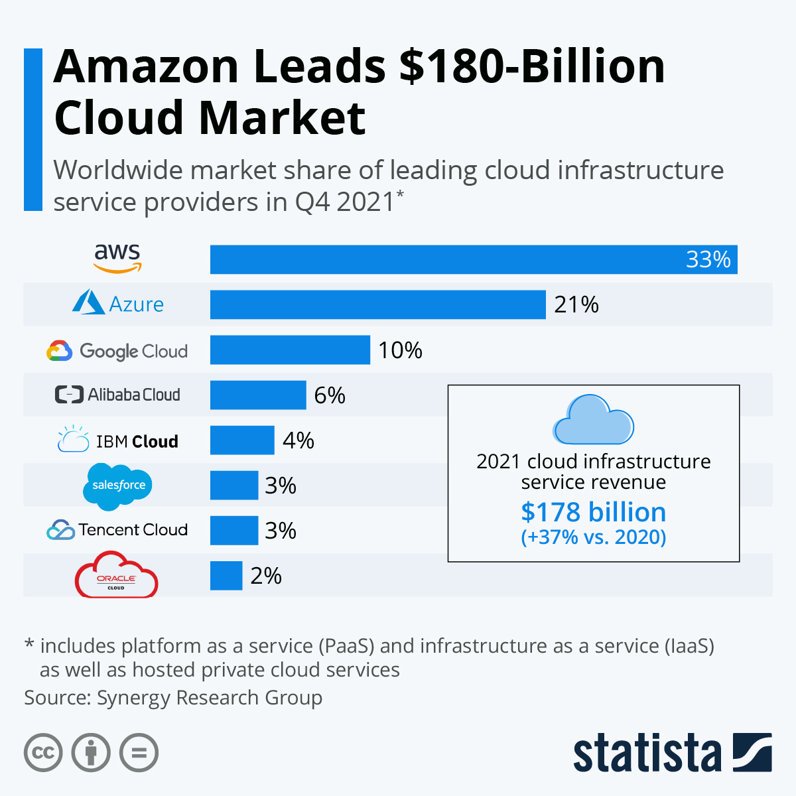

<!--

-->

<!--  -->

# Cloud Computing (AWS)

---

# Agenda

<!-- global-top.vue -->

<v-clicks>

* About me
* Cloud Computing - What, Why
* Amazon Web Services
* Advantages of Cloud Computing
* Career Options

</v-clicks>
---

# About Me

<v-clicks> 

* Abiodun Uthman Allison
* Machine Learning, DevOps
* AWS Certified

</v-clicks>
---

# Cloud Computing - What, Why

<v-clicks>

* In its most basic definition, the cloud is a computer that is located somewhere else, accessed via the internet, and used in some way
* Also called web services
* The cloud comprises server computers in large data centers in different locations around the world. 
* Cloud computing is the on-demand delivery of compute power, database, storage, applications, and other IT resources delivered through a cloud services platform via the internet, with pay-as-you-go pricing
* Cloud computing has quickly become a key driving force for businesses today, as applications are moved out of on-premise data centers in an effort to innovate, reduce costs, and increase agility

</v-clicks>

---

# Amazon Web Services (AWS)

<v-clicks>

* Subsidiary of Amazon that provides on-demand cloud computing platforms and APIs to individuals, businesses, and governments, on a metered pay-as-you-go basis.
* Amazon Web Services offers reliable, scalable, and inexpensive cloud computing services
* The AWS Cloud spans 84 Availability Zones within 26 geographic regions around the world
* AWS services are in different categories, and each category contains one or more services
  

</v-clicks>

---

# AWS Market Share

<!--  -->

<figure>
  
  <figcaption> Source: <a href="https://www.statista.com/chart/18819/worldwide-market-share-of-leading-cloud-infrastructure-service-providers/"> Statistica</a>
  </figcaption>
</figure>

---

# Adavantages of Cloud Computing

<v-clicks>

* Pay only for what you use and how much you use it

* Massive economies of scale
 
* Scale on demand - reduce guessing about capacity
  
* Go global in minutes
  
* Increase speed and agility 
  
* Focus on your customers and your core business

</v-clicks>

<!--
Increase speed - cost and time that are needed to experiment and develop are much lower

Focus on your own customers, rather than on the heavy lifting of racking, stacking, and powering servers
-->

---

# Career Options

<v-clicks>

* Cloud Engineer
* Cloud Architect
* Cloud Consultant
* DevOps Engineer
* Cloud Infrastructure Engineer
* Site Reliability Engineer
* Cloud Security Engineer
* Data Engineer
* Full-Stack Developer 
* Cloud System Administrator
* Machine Learning Engineer
  
</v-clicks>

---

# What next?

<v-clicks>

* Interested in learning more?
* Join our next cloud computing cohort at [HiiT](http://www.hiit.ng/) ...Your Premium Training Partner

</v-clicks>
